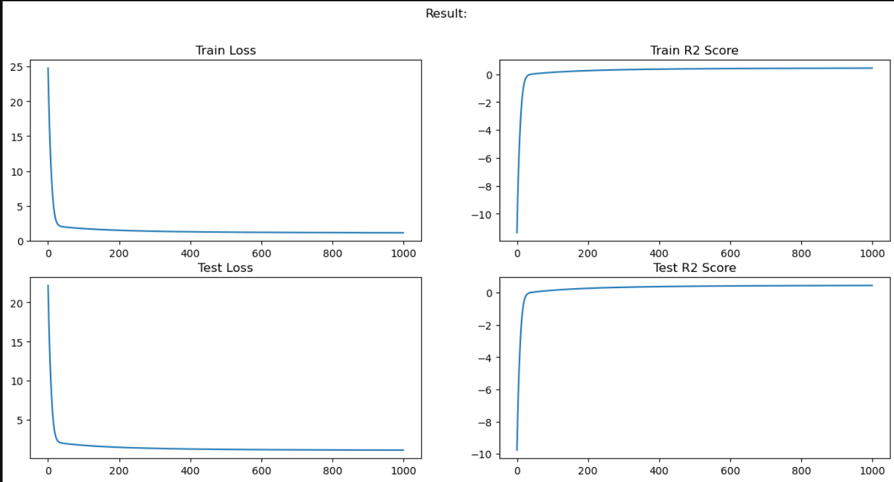

# 🧠 Neural Network for Bike Demand Prediction (From Scratch with NumPy)

This project implements a custom neural network using only NumPy to predict bike rental demand from the Kaggle [Bike Sharing Demand dataset](https://www.kaggle.com/c/bike-sharing-demand).

## 📊 Dataset
- Source: [Kaggle - Bike Sharing Demand](https://www.kaggle.com/c/bike-sharing-demand)
- 18 input features (time, weather, temp, humidity, etc.)
- Target: `count` (number of bike rentals)

## 🧠 Model Architecture
- Input Layer: 18 features
- Hidden Layer 1: 128 neurons (ReLU)
- Hidden Layer 2: 64 neurons (ReLU)
- Output Layer: 1 neuron (Linear)
- Loss: Mean Squared Error (MSE)

## 🏁 Results
- Final R² Score: ~0.43 (Train & Test)
- Model converged cleanly over 1000+ epochs

## 🚀 Run the Project

See the main.ipynb file
